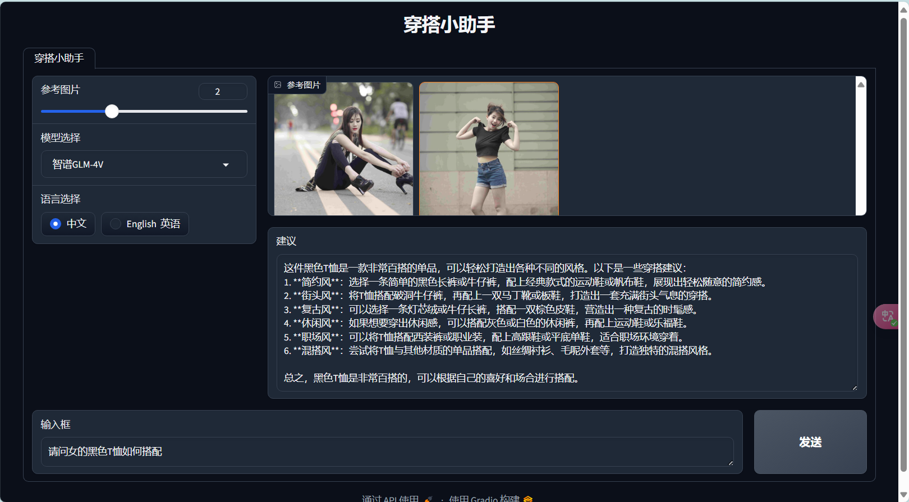

<div align="center">

# 基于 GLM-4V 的穿搭问答助手

</div>


# 介绍

该项目是我在学习多模态大模型RAG的一次简单实践，图文检索部分使用了CLIP模型，图文问答使用智普的GLM-4V模型。项目内容主要包括：

- 基于Fashionpedia 数据集微调 CLIP 模型
- 使用爬虫爬取公开穿搭图片，并调用GLM-4V对图片label和atttribute进行标注
- 将穿搭图像存入向量数据库
- 多路召回策略进行图文检索 基于GLM-4V给出穿搭建议

# 项目展示以操作过程

## UI界面展示



## 安装依赖

```
pip install -r requirements.txt
```


## 基于Fashionpedia 数据集微调 CLIP 模型

关于微调CLIP模型，请参考   [CN-Clip-ImageText-Retrieval](https://github.com/CqGao112/CN-Clip-ImageText-Retrieval)

Fashionpedia数据集：[fashionpedia](https://huggingface.co/datasets/detection-datasets/fashionpedia)

## 转换图像到向量数据库

从Fashionpedia parquet文件提取图像到本地

```
python parquet2Img.py
```

本地图像转换为向量

```
python save2Vector.py
```

## 启动UI界面

```
python app_webui.py
```

